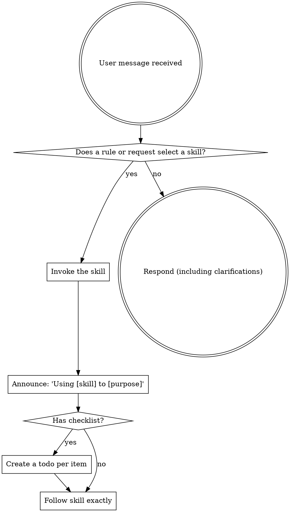

<SUBAGENT-STOP>
If you were dispatched as a subagent to execute a specific task, skip this skill.
</SUBAGENT-STOP>

<EXTREMELY-IMPORTANT>
Canonical rules and higher-priority runtime instructions determine skill
applicability. Use a skill when it is explicitly requested or its documented
trigger matches the task. A skill may specialize a rule but may not weaken or
override it.
</EXTREMELY-IMPORTANT>

## Instruction Priority

Skills provide repository-local procedures. They never override system,
developer, user, repository, or canonical-source instructions. When instructions
conflict, follow the higher-priority instruction and report unresolved ambiguity.

## How to Access Skills

Use platform-native skill activation when available. If unavailable, read the
canonical skill file directly and follow only applicable sections.

**In Gemini CLI:** Skills activate via the `activate_skill` tool. Gemini loads skill metadata at session start and activates the full content on demand.

**In other environments:** Check your platform's documentation for how skills are loaded.

## Platform Adaptation

Skills speak in actions ("dispatch a subagent", "create a todo", "read a file") rather than naming any one runtime's tools. For per-platform tool equivalents and instructions-file conventions, see `references/claude-code-tools.md`, `references/codex-tools.md`, `references/copilot-tools.md`, `references/gemini-tools.md`, `references/pi-tools.md`, and `references/antigravity-tools.md`. Gemini CLI users get the tool mapping loaded automatically via GEMINI.md.

# Using Skills

## The Rule

**Invoke explicitly requested or applicable skills before acting.** If no
documented trigger matches, do not invoke a skill only because it might apply.

## Red Flags

These thoughts mean STOP—you're rationalizing:

| Thought | Reality |
|---------|---------|
| "This is just a simple question" | Questions are tasks. Check for skills. |
| "I need more context first" | Skill check comes BEFORE clarifying questions. |
| "Let me explore the codebase first" | Skills tell you HOW to explore. Check first. |
| "I can check git/files quickly" | Files lack conversation context. Check for skills. |
| "Let me gather information first" | Skills tell you HOW to gather information. |
| "This doesn't need a formal skill" | If no documented trigger matches, do not invoke it. |
| "I remember this skill" | Skills evolve. Read current version. |
| "This doesn't count as a task" | Action = task. Check for skills. |
| "The skill is overkill" | If no documented trigger matches, do not invoke it. |
| "I'll just do this one thing first" | Check BEFORE doing anything. |
| "This feels productive" | Undisciplined action wastes time. Skills prevent this. |
| "I know what that means" | Knowing the concept ≠ using the skill. Invoke it. |

## Skill Priority

When multiple skills could apply, use this order:

1. **Process skills first** (skill-brainstorming, systematic-debugging) - these determine HOW to approach the task
2. **Implementation skills second** (for example `impeccable`, `skill-distinctive-frontend-design`, or `ui-ux-pro-max`) - these guide execution

An explicit user request or approved task contract naming one frontend design skill satisfies overlapping design-skill applicability for that task. Do not invoke another overlapping design skill solely because it is installed, discoverable, or appears applicable; follow `docs/operating_system/rules/frontend-ui-rule.md`.

"Let's build X with unresolved options" → skill-brainstorming. Design-clear local work can execute directly.
"Fix this bug" → debugging first, then domain-specific skills.

## Skill Types

**Rigid** (TDD, systematic-debugging): Follow exactly. Don't adapt away discipline.

**Flexible** (patterns): Adapt principles to context.

The skill itself tells you which.

## User Instructions

Instructions say WHAT, not HOW. "Add X" or "Fix Y" doesn't mean skip workflows.
