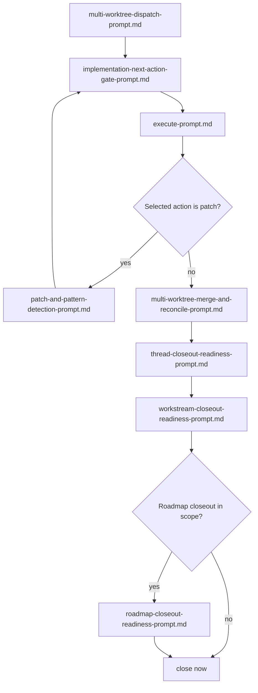

# Prompt Templates

Use these prompts as linked ladders, not as one long linear list.

For multi-step procedures with decision gates, use workflow docs under:

- [../workflows/roadmap-to-closeout-workflow.md](../workflows/roadmap-to-closeout-workflow.md)
- [../workflows/drift-detection-and-reconciliation-workflow.md](../workflows/drift-detection-and-reconciliation-workflow.md)
- [../workflows/spec-to-plan-to-execution-workflow.md](../workflows/spec-to-plan-to-execution-workflow.md)
- [../workflows/multi-worktree-execution-workflow.md](../workflows/multi-worktree-execution-workflow.md)
- [../workflows/live-run-system-workflow.md](../workflows/live-run-system-workflow.md)
- [../workflows/live-run-scenario-planning-workflow.md](../workflows/live-run-scenario-planning-workflow.md)
- [../workflows/live-run-preflight-check-workflow.md](../workflows/live-run-preflight-check-workflow.md)
- [../workflows/live-run-execution-workflow.md](../workflows/live-run-execution-workflow.md)
- [../workflows/live-run-debugging-workflow.md](../workflows/live-run-debugging-workflow.md)
- [../workflows/live-run-verification-workflow.md](../workflows/live-run-verification-workflow.md)
- [../workflows/live-run-closeout-workflow.md](../workflows/live-run-closeout-workflow.md)

## Core Planning Ladder

1. [intent-prompt.md](./intent-prompt.md)
2. [master-workstream-roadmap-build-prompt.md](./master-workstream-roadmap-build-prompt.md)
3. [registered-workstream-set-build-prompt.md](./registered-workstream-set-build-prompt.md)
4. [bounded-change-thread-build-prompt.md](./bounded-change-thread-build-prompt.md)
5. [thread-set-to-spec-set-prompt.md](./thread-set-to-spec-set-prompt.md) (if multi-thread/spec set)
6. [spec-set-to-spec-authoring-map-prompt.md](./spec-set-to-spec-authoring-map-prompt.md) (if needed)
7. [spec-prompt.md](./spec-prompt.md)
8. [spec-set-execution-map-prompt.md](./spec-set-execution-map-prompt.md) (if multi-spec sequencing needed)
9. [plan-prompt.md](./plan-prompt.md)

## Execution Ladder

1. [execute-prompt.md](./execute-prompt.md)
2. [implementation-next-action-gate-prompt.md](./implementation-next-action-gate-prompt.md)
3. If selected action is a patch, run [patch-and-pattern-detection-prompt.md](./patch-and-pattern-detection-prompt.md).
4. Repeat [implementation-next-action-gate-prompt.md](./implementation-next-action-gate-prompt.md) until closure-ready or blocked.

## Multi-Worktree Prompt Ladder

Use in this order:

1. [multi-worktree-dispatch-prompt.md](./multi-worktree-dispatch-prompt.md)
2. [implementation-next-action-gate-prompt.md](./implementation-next-action-gate-prompt.md)
3. [execute-prompt.md](./execute-prompt.md)
4. [patch-and-pattern-detection-prompt.md](./patch-and-pattern-detection-prompt.md) (when selected action is a patch)
5. [multi-worktree-merge-and-reconcile-prompt.md](./multi-worktree-merge-and-reconcile-prompt.md)
6. [thread-closeout-readiness-prompt.md](./thread-closeout-readiness-prompt.md)
7. [workstream-closeout-readiness-prompt.md](./workstream-closeout-readiness-prompt.md)
8. [roadmap-closeout-readiness-prompt.md](./roadmap-closeout-readiness-prompt.md) (if roadmap closure is in scope)

## Closeout Ladder

Use in this order:

1. [thread-closeout-readiness-prompt.md](./thread-closeout-readiness-prompt.md)
2. [workstream-closeout-readiness-prompt.md](./workstream-closeout-readiness-prompt.md)
3. [roadmap-closeout-readiness-prompt.md](./roadmap-closeout-readiness-prompt.md)
4. [multi-worktree-merge-and-reconcile-prompt.md](./multi-worktree-merge-and-reconcile-prompt.md) (for multi-lane PR/merge + reconciliation)

## Reconciliation Ladder (After Roadmap Format Change)

1. [downstream-reconciliation-after-roadmap-format-change.md](./downstream-reconciliation-after-roadmap-format-change.md)
2. [implementation-next-action-gate-prompt.md](./implementation-next-action-gate-prompt.md)
3. Continue into Closeout Ladder when blockers are resolved.

## Drift And Alignment Ladder

1. [validate-or-drift-prompt.md](./validate-or-drift-prompt.md)
2. [roadmap-vs-execution-divergence-prompt.md](./roadmap-vs-execution-divergence-prompt.md)
3. [workstream-completion-and-intent-check-prompt.md](./workstream-completion-and-intent-check-prompt.md) (if completion verdict is needed)

## Routing Helpers

- [roadmap-to-workstream-prompt.md](./roadmap-to-workstream-prompt.md)
- [workstream-to-spec-prompt.md](./workstream-to-spec-prompt.md)
- [workstream-alignment-review-prompt.md](./workstream-alignment-review-prompt.md)
- [roadmap-gap-prompt.md](./roadmap-gap-prompt.md)
- [parallel-bounded-change-planning-prompt.md](./parallel-bounded-change-planning-prompt.md)
- [multi-worktree-dispatch-prompt.md](./multi-worktree-dispatch-prompt.md)
- [multi-worktree-merge-and-reconcile-prompt.md](./multi-worktree-merge-and-reconcile-prompt.md)

## Live Run Helpers

- [live-run-system-dispatch-prompt.md](./live-run-system-dispatch-prompt.md)
- [live-run-closeout-decision-prompt.md](./live-run-closeout-decision-prompt.md)

## Maintenance Helpers

- [thread-checkpoint-result-pack-prompt.md](./thread-checkpoint-result-pack-prompt.md)
- [required-root-doc-update-prompt.md](./required-root-doc-update-prompt.md)
- [starter-baseline-sync-prompt.md](./starter-baseline-sync-prompt.md)
- [managed-metadata-update-prompt.md](./managed-metadata-update-prompt.md)
- [mode-migration-prompt.md](./mode-migration-prompt.md)
- [provider-history-sync-prompt.md](./provider-history-sync-prompt.md)
- [gitnexus-refresh-prompt.md](./gitnexus-refresh-prompt.md)
- [patch-and-pattern-detection-prompt.md](./patch-and-pattern-detection-prompt.md)

## Notes

- Use the smallest ladder that matches your current state.
- Prefer prompt prerequisites and next-prompt links over ad hoc prompt jumping.
- `Related Skills` sections are intentionally added only to high-impact prompts.
- `operating_system` remains a parallel branch when work is repo-method, not product-direction.
- Use `prompt_templates/` for single prompts; use `workflows/` for sequenced procedures.
